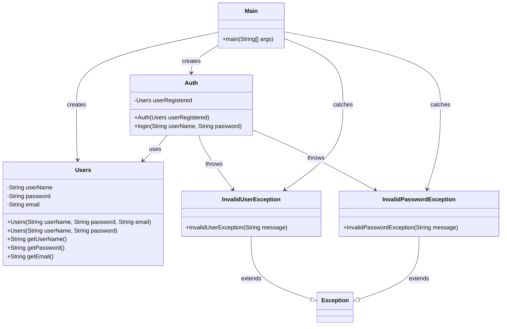

# Login Java

A simple Java authentication system with both console and web-based frontend interfaces.

## Features

- Console-based login interface
- Web-based login frontend with beautiful UI
- Exception handling for invalid credentials
- HTTP server with REST API

## UML Class Diagram



## How to Run

### Console Version

```bash
# Compile
javac -cp . src/main/java/*.java -d bin

# Run console version
java -cp bin main.java.Main
```

### Web Frontend

```bash
# Compile
javac -cp . src/main/java/*.java -d bin

# Start web server
java -cp bin main.java.LoginServer
```

Then open your browser and go to: `http://localhost:8080`

**Demo Credentials:**

- Username: `testUser`
- Password: `testPass`

## Getting Started

Welcome to the VS Code Java world. Here is a guideline to help you get started to write Java code in Visual Studio Code.

## Folder Structure

The workspace contains two folders by default, where:

- `src`: the folder to maintain sources
- `lib`: the folder to maintain dependencies

Meanwhile, the compiled output files will be generated in the `bin` folder by default.

> If you want to customize the folder structure, open `.vscode/settings.json` and update the related settings there.

## Dependency Management

The `JAVA PROJECTS` view allows you to manage your dependencies. More details can be found [here](https://github.com/microsoft/vscode-java-dependency#manage-dependencies).
